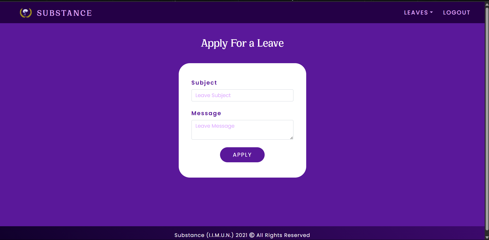
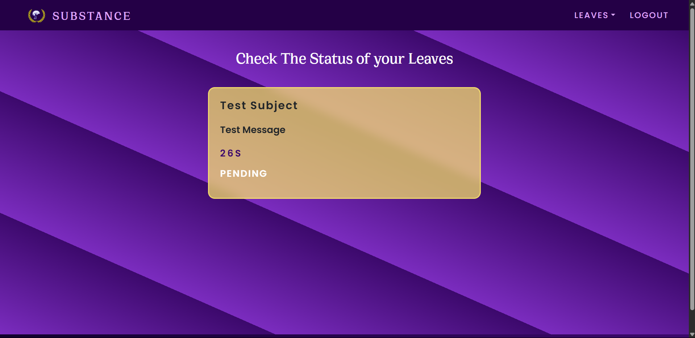
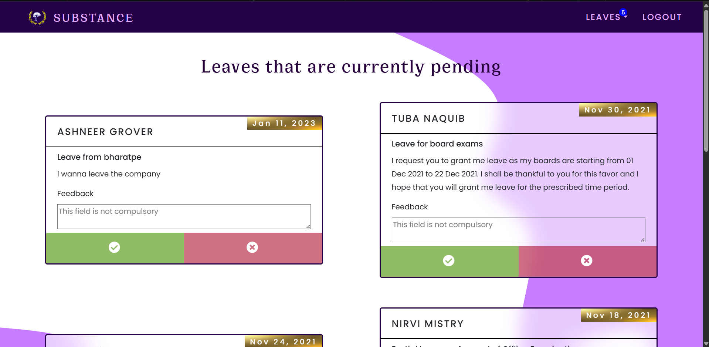

# 🏛️ Substance I.I.M.U.N. – HR Management Web Portal

An internal HR and attendance portal built for the **Substance Department of I.I.M.U.N.**, designed to streamline operations, manage intern leave applications, and improve visibility for the admin team.

> 👨‍💻 Developed and maintained by **Taman Bachani**, Assistant Director – Substance Department (2020-2022) 
> 🌐 **Live Demo**: [https://substance-iimun.onrender.com/](https://substance-iimun.onrender.com/)

---

## 🚀 Key Features

### 👥 User (Intern) Panel
- 🔐 Secure login with **cookie-based session management**
- 🆔 I.I.M.U.N. ID verification at registration
- 📝 Leave application form with validation
- 📂 View personal leave history and status
- 💬 Receive feedback/comments on rejected leaves

### 🛠️ Admin Panel
- ✅ Approve / ❌ Reject leave applications
- 📅 View all intern applications by date or user
- 🧾 Add custom feedback to individual leave requests
- 📊 Dashboard-style overview for simplified admin control

---

## 📸 Screenshots

_(Coming soon — after uploading to `/assets` folder)_

| Login Page | User Dashboard | Admin Panel |
|------------|----------------|-------------|
|  |  |  |

---

## 🎥 Demo Video

📺 *Coming soon* — YouTube walkthrough will be embedded here.

---

## 🧰 Tech Stack

| Frontend | Backend | Auth/Session | Hosting |
|----------|---------|--------------|---------|
| HTML, CSS, JS | Node.js + Express | Cookies & Sessions | Render.com |
| Bootstrap | MongoDB (`db.js`) | Express Middleware | |

---

## 📁 Project Structure

```bash
.
├── client/             # Frontend (HTML/CSS/JS)
├── middleware/         # Auth/session handling
├── models/             # Data structure logic
├── routes/             # Routing logic
├── server.js           # Main entry point
├── Dockerfile.render   # Docker config for deployment
├── render.yaml         # Render deployment config
└── .env                # Environment variables (not tracked)
